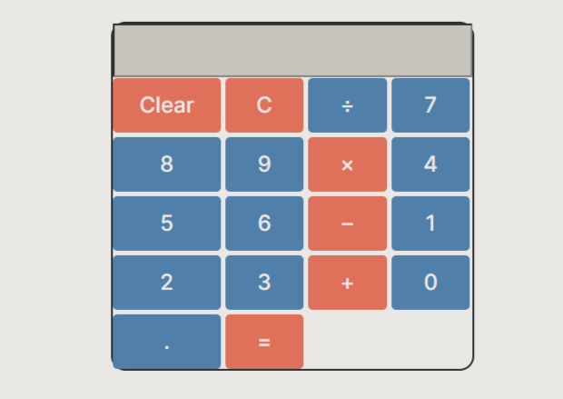
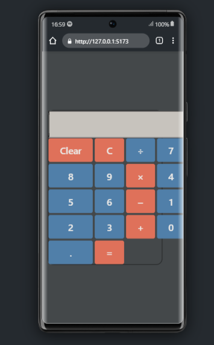

# Calculadora em React JS

Projeto de uma calculadora simples desenvolvida em React JS referente ao curso de Front End da escola Vai na Web, estilizada com Styled Components para criar uma interface agradável e responsiva.

## Funcionalidades

- Realiza operações de soma, subtração, multiplicação e divisão.
- Limpa o visor da calculadora.
- Calcula e exibe resultados precisos.

## Pré-requisitos

- [Node.js](https://nodejs.org/) - Certifique-se de ter o Node.js instalado na sua máquina.

## Tecnologias Utilizadas

-Vite (para criar o projeto).
-NPM (rode npm run dev para rodar localmente o projeto). 
-ReactJS (usando o React para fazer a lógica da calculadora usando principalmente o Hook useState).
-Styled Components (para estilizar a calculadora).

## Estrutura do Projeto

- `src/`: Esta pasta contém o código-fonte do projeto.
  - `assets/`: Aqui estão armazenados recursos estáticos, como imagens.
  - `Components/`: Os componentes React, incluindo o componente `Calculadora.jsx`, estão localizados aqui.
  - `App.js`: O ponto de entrada da aplicação React.
- `public/`: Esta pasta contém arquivos públicos, como o arquivo HTML principal.
- `node_modules/`: As dependências do projeto são instaladas nesta pasta.
- `package.json`: O arquivo de configuração do Node.js que lista as dependências e scripts.
- `README.md`: Este arquivo, que fornece informações sobre o projeto.

## Licença

Este projeto é licenciado sob a Licença MIT - consulte o arquivo [LICENSE](LICENSE) para obter detalhes.

## Demonstração

### Você pode testar a calculadora através deste [Link](https://lsantana95.github.io/Calculadora/)

### Versão Desktop:

### Versão Mobile:

## Autor

-Leonardo Santana
